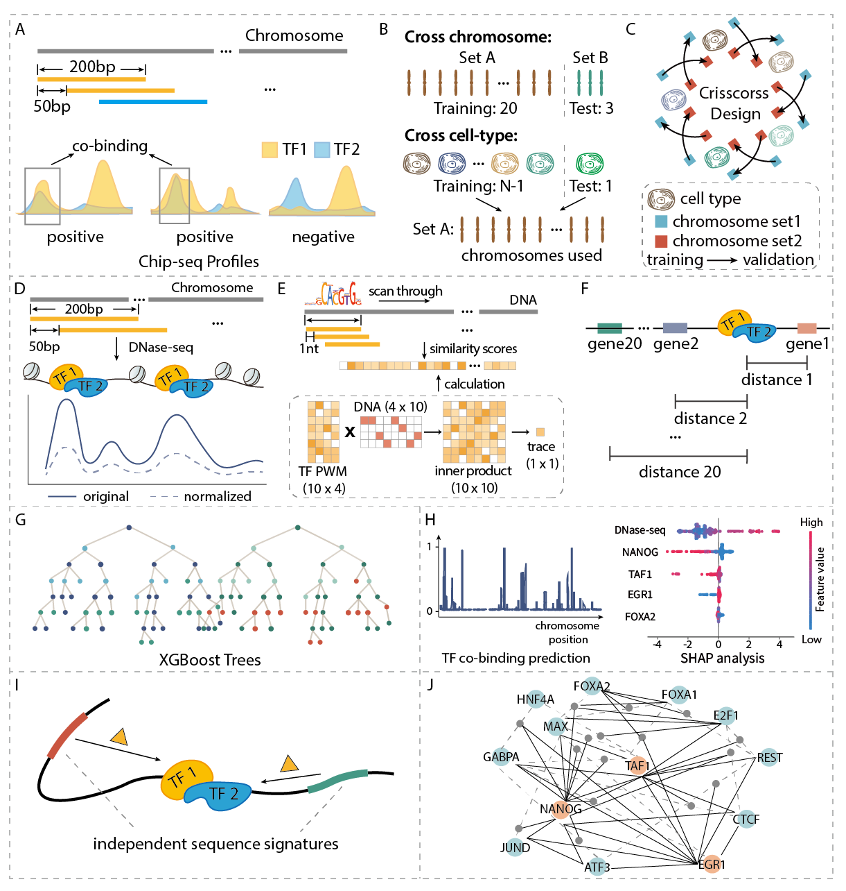

## Evidence of widespread independent sequence signature for transcription factor co-binding

Please contact (mqzhou@umich.edu or hyangl@umich.edu or gyuanfan@umich.edu) if you have any questions or suggestions.



---

## Installation
Git clone a copy of code:
```
git clone https://github.com/GuanLab/Sequence_Analysis_for_TF-co-binding.git
```
## Required dependencies

* [python](https://www.python.org) (3.6.5)
* [numpy](http://www.numpy.org/) (1.13.3). It comes pre-packaged in Anaconda.
* [R](https://www.r-project.org/)(3.6.1)
* [perl](https://www.perl.org/) (5.10.1)
* [xgboost](https://github.com/dmlc/xgboost/blob/master/demo/binary_classification/README.md)

## Dataset

* [Genomic coordinates](https://www.synapse.org/#!Synapse:syn6184308)
* [DNase-seq](https://www.encodeproject.org/experiments/ENCSR000EMU/)
* [DNA sequence and motif](http://hocomoco11.autosome.ru/downloads_v11)
* [Gencode](https://www.gencodegenes.org/human/release_19.html)


